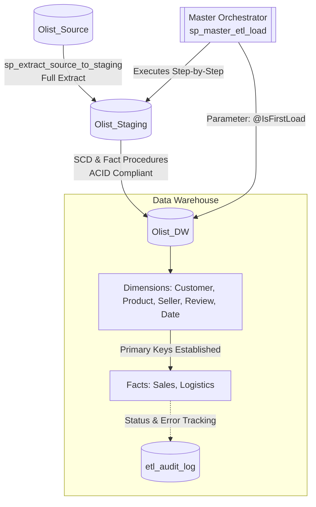
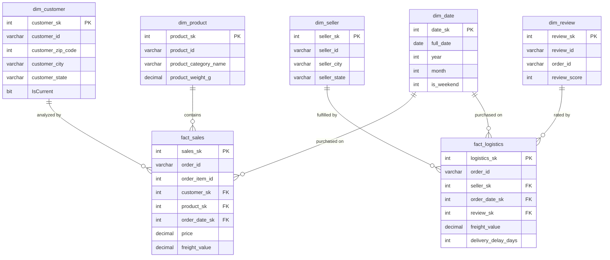

<div align="center">

# 🛒 Olist E-Commerce Data Warehouse

**A star-schema data warehouse and nightly ETL pipeline built on the Olist marketplace dataset**, featuring full-scale data orchestration, SCD-managed dimensions, comprehensive audit logging, and fact tables for sales and logistics analytics.


</div>

---

**Course:** Database 2
**Tech Stack:** SQL Server · T-SQL · Windows Task Scheduler · GitHub

## 📑 Table of Contents

- [1. Project Architecture & ETL Flow](#1-project-architecture--etl-flow)
- [2. Star Schema Entity Relationship (ER) Diagram](#2-star-schema-entity-relationship-er-diagram)
- [3. Data Mapping & ETL Documentation](#3-data-mapping--etl-documentation)
- [4. Auditing & Validation](#4-auditing--validation)
- [5. Orchestration & Automation](#5-orchestration--automation)
- [6. Repository Structure](#6-repository-structure)
- [7. Getting Started](#7-getting-started)

---

## 1. Project Architecture & ETL Flow

The data architecture follows a strict, 3-tier environment model, extracting data from the highly distributed Olist marketplace into a centralized analytical engine.



| Tier | Database | Role |
|---|---|---|
| **Source** | `Olist_Source` | Raw marketplace data ingested from Kaggle CSVs. |
| **Staging** | `Olist_Staging` | Full extract landing zone, untransformed. |
| **Warehouse** | `Olist_DW` | Star-schema warehouse loaded via T-SQL stored procedures. |

---

## 2. Star Schema Entity Relationship (ER) Diagram

The analytical environment is built on a star schema containing two distinct data marts: **Sales** and **Logistics**.



---

## 3. Data Mapping & ETL Documentation

This section defines the extraction logic and transformation rules applied to each dimension and fact table.

### 3.1 Dimensions

| Table | Strategy | Source Table(s) | Transformation Logic |
|---|---|---|---|
| `dim_customer` | SCD Type 2 | `stg_customers` | Geographic changes trigger a new row insertion. Uses `IsCurrent`, `ValidFrom`, and `ValidTo` tracking flags. |
| `dim_product` | SCD Type 3 | `stg_products` | Structural updates only — no row duplication; historical attributes are added as new columns if category definitions change. |
| `dim_seller` | SCD Type 1 | `stg_sellers` | Standard overwrite. Contact/location updates replace existing data directly via a `MERGE` statement. |
| `dim_review` | Static | `stg_reviews` | Mapped to `order_id`. A default `-1` surrogate key row is injected to handle facts with missing reviews. |
| `dim_date` | Generative | N/A | Procedurally generated using a `WHILE` loop from `2016-01-01` to `2019-12-31`. Weekends calculated via `DATEPART`. |

### 3.2 Fact Tables (Data Marts)

#### 🧾 Fact Sales (Sales Mart)

**Business Goal:** Analyze revenue, pricing behavior, and customer purchasing patterns.

**Transformations:**
- `order_date_sk` — extracted from `order_purchase_timestamp` and converted to a standard `YYYYMMDD` integer key.
- **Safety mechanism:** Transaction-controlled (`BEGIN TRAN`), idempotent load using `WHERE NOT EXISTS` on `order_id` and `order_item_id` to prevent duplication.

#### 🚚 Fact Logistics (Logistics Mart)

**Business Goal:** Analyze shipping times, delivery delays, and freight costs across regions.

**Transformations:**
- `delivery_delay_days` — computed as `DATEDIFF(day, estimated_delivery, actual_delivery)`. Negative values indicate early deliveries.
- **Default constraints:** Uses `ISNULL(r.review_sk, -1)` and `ISNULL(s.seller_sk, -1)` to preserve referential integrity when source data is missing.

---

## 4. Auditing & Validation

To ensure enterprise-grade reliability, the data warehouse features built-in operational monitoring and validation suites:

- **Audit Logging (`etl_audit_log`):** A centralized logging table captures the precise execution time, target table, action description, and execution status (`SUCCESS`, `FAILED`, `RUNNING`) for every stored procedure.
- **Failure Recovery:** Log insertions are handled outside of the main transaction block using `TRY/CATCH`, ensuring failure reasons are permanently recorded even if the ETL transaction rolls back.
- **Data Validation Suite:** A dedicated [`06_tests_and_validation`](./06_tests_and_validation) directory contains scripts to verify row counts across all 3 tiers, confirm referential integrity (`Unknown -1` records), and test the SCD Type 2 historical tracking logic.

---

## 5. Orchestration & Automation

The entire ETL pipeline is controlled by a single master stored procedure (`sp_master_etl_load`) with parameterized execution paths.

| Component | Detail |
|---|---|
| **Master Orchestrator** | `EXEC dbo.sp_master_etl_load @IsFirstLoad = 1;` |
| **Routing Logic** | Uses the `@IsFirstLoad` flag to intelligently route traffic to high-speed bulk inserts (First Load) or idempotent `MERGE` statements (Incremental). |
| **Execution Engine** | `sqlcmd` utility invoked via a `.bat` script |
| **Scheduler** | Windows Task Scheduler |
| **Trigger** | Daily at `02:00:00 AM` |

---

## 6. Repository Structure

```
📦 olist-data-warehouse
├── 01_source/                  # Source database schema & Kaggle CSV loaders
├── 02_staging/                 # Staging tables & sp_extract_source_to_staging
├── 03_dimensions/              # SCD Type 1/2/3 dimension load procedures
├── 04_facts/                   # fact_sales & fact_logistics load procedures
├── 05_orchestration/           # sp_master_etl_load & .bat scheduler scripts
├── 06_tests_and_validation/    # Row count, referential integrity & SCD tests
└── README.md
```

## 7. Getting Started

1. **Restore the source data** into `Olist_Source` using the Kaggle CSV loaders in `01_source/`.
2. **Provision the databases**: `Olist_Source`, `Olist_Staging`, and `Olist_DW`.
3. **Run the first load**:
   ```sql
   EXEC dbo.sp_master_etl_load @IsFirstLoad = 1;
   ```
4. **Schedule incremental runs** via Windows Task Scheduler (daily, 02:00 AM), calling the `.bat` script in `05_orchestration/`.
5. **Validate the load** using the scripts in `06_tests_and_validation/` to confirm row counts and referential integrity.

---

<div align="center">

Built as part of a **Database 2** course project.
**Contributors:** Yasin Saberi

</div>
