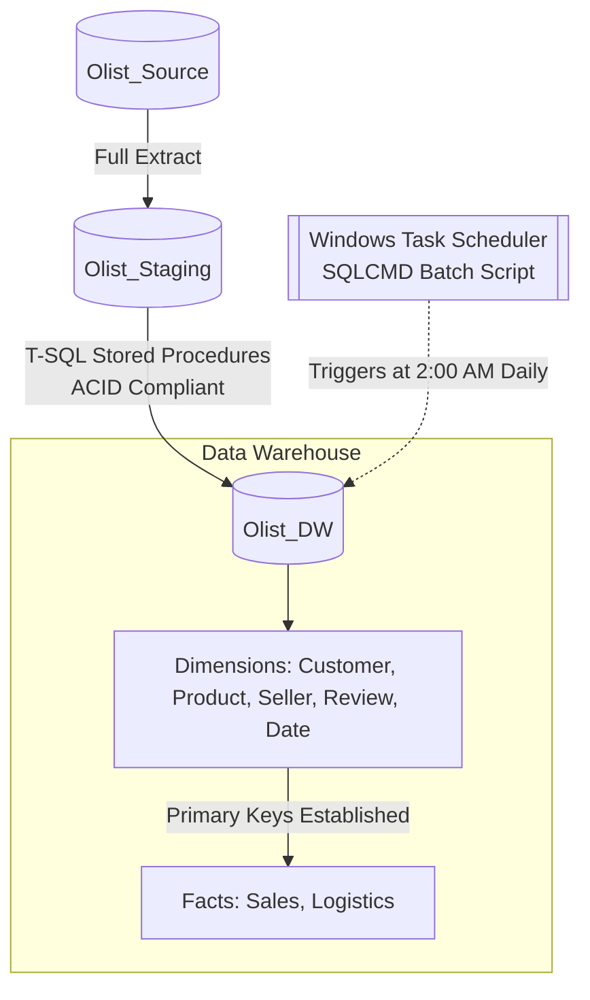
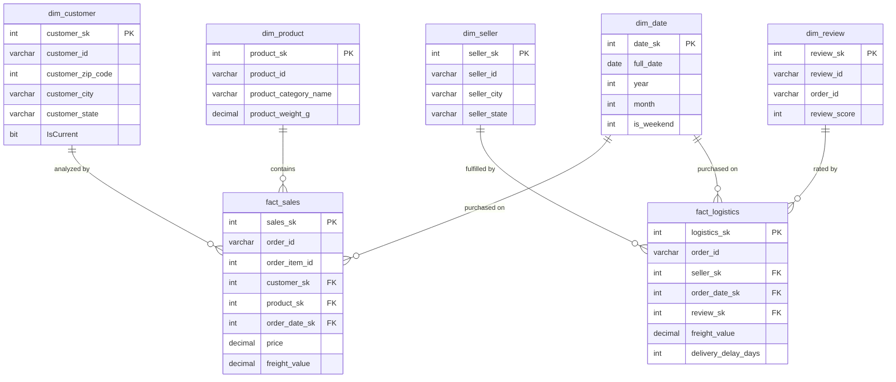

# 🛒 Olist E-Commerce Data Warehouse

**A star-schema data warehouse and nightly ETL pipeline built on the Olist marketplace dataset**, covering staging, SCD-managed dimensions, and fact tables for sales and logistics analytics.

---

**Course:** Database 2
**Tech Stack:** SQL Server, T-SQL, Windows Task Scheduler, GitHub

## 📑 Table of Contents

- [Project Architecture & ETL Flow](#1-project-architecture--etl-flow)
- [Star Schema ER Diagram](#2-star-schema-entity-relationship-er-diagram)
- [Data Mapping & ETL Documentation](#3-data-mapping--etl-documentation)
- [Orchestration & Automation](#4-orchestration--automation)

## 1. Project Architecture & ETL Flow

The data architecture follows a strict, 3-tier environment model, extracting data from the highly distributed Olist marketplace.

| Tier | Database | Role |
|---|---|---|
| Source | `Olist_Source` | Raw marketplace data as originally distributed |
| Staging | `Olist_Staging` | Full extract landing zone, untransformed |
| Warehouse | `Olist_DW` | Star-schema warehouse loaded via T-SQL stored procedures |

## 2. Star Schema Entity Relationship (ER) Diagram

The analytical environment is built on a **star schema** containing two distinct data marts: **Sales** and **Logistics**.

## 3. Data Mapping & ETL Documentation

This section defines the extraction logic and transformation rules applied to each dimension and fact table.

### 3.1 Dimensions

| Table | Strategy | Source Table(s) | Transformation Logic |
|---|---|---|---|
| `dim_customer` | SCD Type 2 | `stg_customers` | Geographic changes trigger a new row insertion. Uses `IsCurrent`, `ValidFrom`, and `ValidTo` tracking flags. |
| `dim_product` | SCD Type 3 | `stg_products` | Structural updates only — no row duplication; historical attributes are added as new columns if category definitions change. |
| `dim_seller` | SCD Type 1 | `stg_sellers` | Standard overwrite. Contact/location updates replace existing data directly via a `MERGE` statement. |
| `dim_review` | Static | `stg_order_reviews` | Mapped to `order_id`. A default `-1` surrogate key row is injected to handle facts with missing reviews. |
| `dim_date` | Generative | N/A | Procedurally generated using a `WHILE` loop from `2016-01-01` to `2019-12-31`. Weekends calculated via `DATEPART`. |

### 3.2 Fact Tables (Data Marts)

#### 🧾 Fact Sales (Sales Mart)

**Business Goal:** Analyze revenue, pricing behavior, and customer purchasing patterns.

**Sources:** `stg_orders`, `stg_order_items`

**Transformations:**
- `order_date_sk` — extracted from `order_purchase_timestamp` and converted to a standard `YYYYMMDD` integer key.
- **Safety mechanism:** Transaction-controlled (`BEGIN TRAN`), idempotent load using `WHERE NOT EXISTS` on `order_id` and `order_item_id` to prevent duplication.

#### 🚚 Fact Logistics (Logistics Mart)

**Business Goal:** Analyze shipping times, delivery delays, and freight costs across regions.

**Sources:** `stg_orders`, `stg_order_items`

**Transformations:**
- `delivery_delay_days` — computed as `DATEDIFF(day, estimated_delivery, actual_delivery)`. Negative values indicate early deliveries.
- **Default constraints:** Uses `ISNULL(r.review_sk, -1)` and `ISNULL(s.seller_sk, -1)` to preserve referential integrity when source data is missing.
- **Safety mechanism:** Idempotent incremental loading, mirroring the Sales Mart.

## 4. Orchestration & Automation

Due to SQL Server Express Edition limitations (no SQL Server Agent available), the pipeline is orchestrated at the OS level rather than inside the database engine.

| Component | Detail |
|---|---|
| **Execution engine** | `sqlcmd` utility invoked via a `.bat` script |
| **Scheduler** | Windows Task Scheduler |
| **Trigger** | Daily at `02:00:00 AM` |
| **Order of operations** | Dimensions load first to establish primary keys, followed by fact tables, which enforce the corresponding foreign key relationships |

---

Built as part of a Database 2 course project.

