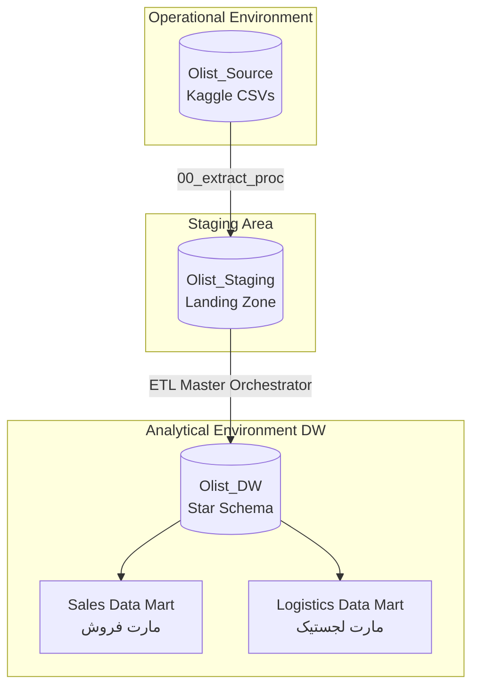
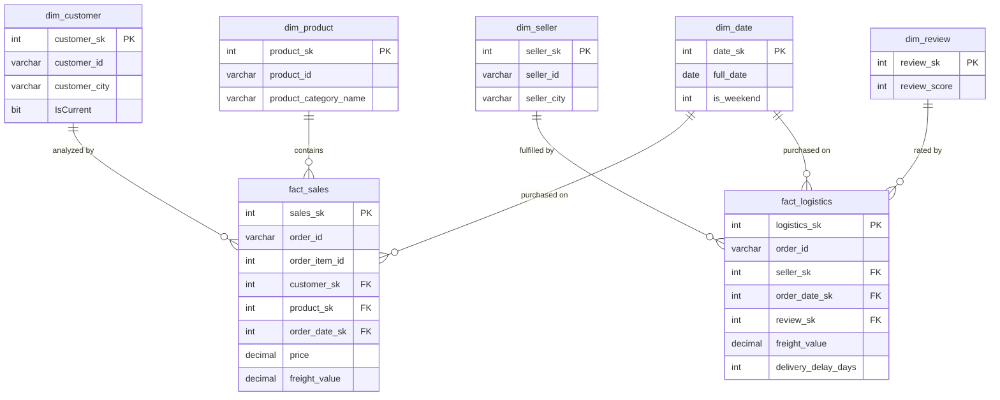

# مستند معماری و طراحی انبار داده (Olist DW Architecture)

## ۱. معماری سیستم (System Architecture)
این انبار داده بر اساس معماری استاندارد ۳ لایه‌ای (3-Tier Architecture) و به طور کامل در محیط Microsoft SQL Server پیاده‌سازی شده است:

۱. **لایه Olist_Source:** دیتابیس عملیاتی که نمایانگر داده‌های خام و توزیع‌شده است.
۲. **لایه Olist_Staging (SA):** منطقه فرود (Landing Zone) داده‌ها. این لایه تضمین می‌کند که سیستم عملیاتی در طول فرآیندهای سنگین تبدیل داده (Transformation) قفل نشود.
۳. **لایه Olist_DW:** دیتابیس تحلیلی اصلی که با استفاده از مدل‌سازی ابعادی (Dimensional Modeling) طراحی شده است.

## ۲. دیتا مارت‌ها (Data Marts)
این پروژه دو فرآیند تجاری مجزا را از طریق دو دیتا مارت که دارای ابعاد مشترک (Conformed Dimensions) هستند، پوشش می‌دهد:
*   **دیتا مارت فروش (Sales):** متمرکز بر جدول `fact_sales` جهت تحلیل درآمد، رفتار قیمت‌گذاری و الگوهای خرید مشتریان در طول زمان و مکان.
*   **دیتا مارت لجستیک (Logistics):** متمرکز بر جدول `fact_logistics` جهت نظارت بر عملکرد تحویل، تاخیر در ارسال و هزینه‌های حمل‌ونقل کالا.

## ۳. نمودار موجودیت-رابطه مدل ستاره‌ای (Star Schema ER Diagram)

*(توجه: برای مشاهده نقشه کامل یکپارچگی ارجاعی، به محدودیت‌های کلید اصلی و کلید خارجی در کدهای SQL مراجعه شود).*
