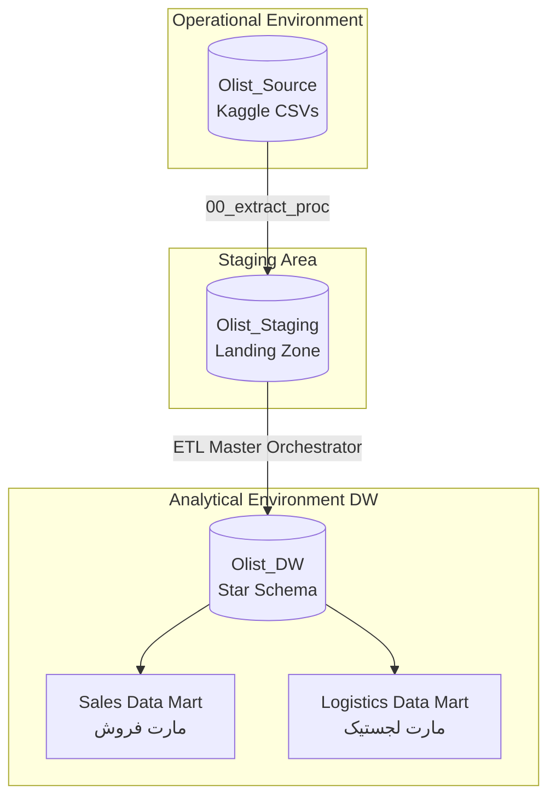
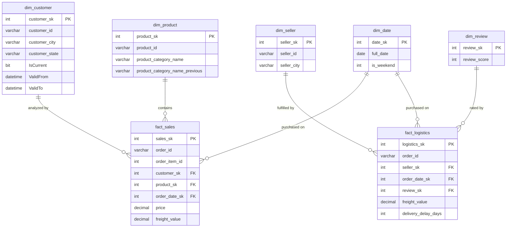

# مستند معماری و طراحی انبار داده (Olist DW Architecture)

**پروژه:** Olist E-Commerce Data Warehouse
**پلتفرم:** Microsoft SQL Server
**الگوی مدل‌سازی:** Dimensional Modeling / Star Schema

## فهرست مطالب
- [۱. معماری سیستم (System Architecture)](#۱-معماری-سیستم-system-architecture)
- [۲. دیتا مارت‌ها (Data Marts)](#۲-دیتا-مارتبها-data-marts)
- [۳. ماتریس گذرگاه (Bus Matrix)](#۳-ماتریس-گذرگاه-bus-matrix)
- [۴. نمودار موجودیت-رابطه مدل ستاره‌ای (Star Schema ER Diagram)](#۴-نمودار-موجودیت-رابطه-مدل-ستارحای-star-schema-er-diagram)
- [۵. قرارداد نام‌گذاری و کلیدها](#۵-قرارداد-نامبگذاری-و-کلیدها)
- [۶. ملاحظات و محدودیت‌های طراحی](#۶-ملاحظات-و-محدودیتبهای-طراحی)

---

## ۱. معماری سیستم (System Architecture)
این انبار داده بر اساس معماری استاندارد ۳ لایه‌ای (3-Tier Architecture) و به‌طور کامل در محیط Microsoft SQL Server پیاده‌سازی شده است:

۱. **لایه Olist_Source:** دیتابیس عملیاتی که نمایانگر داده‌های خام و توزیع‌شده است.
۲. **لایه Olist_Staging (SA):** منطقه فرود (Landing Zone) داده‌ها. این لایه تضمین می‌کند که سیستم عملیاتی در طول فرآیندهای سنگین تبدیل داده (Transformation) قفل نشود.
۳. **لایه Olist_DW:** دیتابیس تحلیلی اصلی که با استفاده از مدل‌سازی ابعادی (Dimensional Modeling) طراحی شده است.

> جزئیات دقیق منطق تبدیل هر جدول در سند مکمل `ETL_Mapping_Document.md` آمده است.

---

## ۲. دیتا مارت‌ها (Data Marts)
این پروژه دو فرآیند تجاری مجزا را پوشش می‌دهد:

*   **دیتا مارت فروش (Sales):** متمرکز بر جدول `fact_sales` (گرین: هر ردیف = یک قلم کالا در یک سفارش) جهت تحلیل درآمد، رفتار قیمت‌گذاری و الگوهای خرید مشتریان در طول زمان و مکان.
*   **دیتا مارت لجستیک (Logistics):** متمرکز بر جدول `fact_logistics` (گرین: هر ردیف = یک سفارش) جهت نظارت بر عملکرد تحویل، تاخیر در ارسال و هزینه‌های حمل‌ونقل کالا.

---

## ۳. ماتریس گذرگاه (Bus Matrix)
این ماتریس نشان می‌دهد کدام بُعد به کدام فکت متصل است. تنها `dim_date` واقعاً بین دو مارت مشترک (Conformed) است؛ سایر ابعاد اختصاصی هر مارت هستند.

| بُعد | fact_sales | fact_logistics |
| :--- | :---: | :---: |
| **dim_customer** | ✅ | — |
| **dim_product** | ✅ | — |
| **dim_seller** | — | ✅ |
| **dim_review** | — | ✅ |
| **dim_date** (Conformed) | ✅ | ✅ |

---

## ۴. نمودار موجودیت-رابطه مدل ستاره‌ای (Star Schema ER Diagram)

*(توجه: برای مشاهده نقشه کامل یکپارچگی ارجاعی، به محدودیت‌های کلید اصلی و کلید خارجی در کدهای SQL مراجعه شود.)*

---

## ۵. قرارداد نام‌گذاری و کلیدها
*   تمام کلیدهای جایگزین با پسوند `_sk` نام‌گذاری می‌شوند (مثلاً `customer_sk`).
*   کلید طبیعی منبع (`customer_id`, `product_id`, ...) در ابعاد نگه‌داری می‌شود تا امکان ردیابی به داده‌ی خام حفظ شود.
*   رکورد پیش‌فرض «نامشخص/موجود نیست» در تمام ابعاد با `sk = -1` نمایش داده می‌شود (نگاه کنید به بخش ۲ سند ETL).
*   کلیدهای زمان (`order_date_sk`) به شکل `YYYYMMDD (int)` تولید می‌شوند تا Join و Partitioning ساده‌تر شود.

---

## ۶. ملاحظات و محدودیت‌های طراحی
*   **بدون بعد سفارش/وضعیت (`dim_order_status`):** وضعیت سفارش (delivered, canceled, ...) در حال حاضر در هیچ‌کدام از فکت‌ها ذخیره نمی‌شود؛ در صورت نیاز به گزارش نرخ لغو سفارش، افزودن این بُعد پیشنهاد می‌شود.
*   **بدون بعد پرداخت (`dim_payment`):** روش و اقساط پرداخت در دیتاست خام Kaggle موجود است ولی در این طراحی وارد نشده است.
*   **تاریخچه‌ی محدود در `dim_product` (Type 3):** فقط یک نسل تغییر دسته‌بندی قابل بازیابی است؛ برای تحلیل‌های تاریخی عمیق‌تر Type 2 مناسب‌تر خواهد بود.
*   **گرین متفاوت دو فکت:** همان‌طور که در بخش ۲ اشاره شد، `fact_sales` در سطح قلم کالا و `fact_logistics` در سطح سفارش است؛ این تفاوت هنگام نوشتن گزارش‌های ترکیبی باید مدنظر قرار گیرد.
