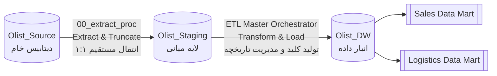

# مستند نگاشت و انتقال داده‌ها (Olist ETL Mapping)

**نسخه:** 2.0
**پروژه:** Olist E-Commerce Data Warehouse
**پلتفرم:** Microsoft SQL Server / T-SQL
**دامنه‌ی داده:** سفارش‌های ثبت‌شده در بازه‌ی ۲۰۱۶ تا ۲۰۱۸ (دیتاست Kaggle)

## فهرست مطالب
- [۰. مقدمه و دامنه سند](#۰-مقدمه-و-دامنه-سند)
- [فلوچارت کلی پایپ‌لاین ETL](#فلوچارت-کلی-پایپلاین-etl)
- [۱. نگاشت از لایه منبع به استیجینگ](#۱-نگاشت-از-لایه-منبع-به-استیجینگ-source-to-staging)
- [۲. نگاشت ابعاد انبار داده](#۲-نگاشت-ابعاد-انبار-داده-staging-to-dimensions)
- [۳. نگاشت فکت‌ها و دیتا مارت‌ها](#۳-نگاشت-فکتبها-و-دیتا-مارتبها-staging-to-facts)
- [۴. کنترل کیفیت داده و مدیریت خطا](#۴-کنترل-کیفیت-داده-و-مدیریت-خطا)

---

## ۰. مقدمه و دامنه سند
این مستند قوانین استخراج، تبدیل و بارگذاری (ETL) را که برای انتقال داده‌ها از سیستم عملیاتی خام (Source) به لایه میانی (Staging) و در نهایت به انبار داده (Data Warehouse) اعمال شده‌اند، تشریح می‌کند. این سند مکمل `Data_Warehouse_Design.md` است و باید هم‌زمان با آن مطالعه شود، چون طراحی ابعاد (Dimension) و فکت‌ها در آن سند تعریف شده و منطق بارگذاری‌شان اینجا آمده است.

> **توجه:** از آنجا که دیتاست منبع، یک بار مصرف و تاریخی (Historical Snapshot سال‌های ۲۰۱۶-۲۰۱۸) است، راهبرد Full Extract / Truncate-Load برای لایه‌ی Staging انتخاب شده است. در یک محیط عملیاتی واقعی و پیوسته، این بخش معمولاً باید به یک راهبرد افزایشی (Incremental، مثلاً بر اساس `updated_at` یا CDC) تغییر کند تا حجم I/O روی منبع کاهش یابد.

## فلوچارت کلی پایپ‌لاین ETL

---

## ۱. نگاشت از لایه منبع به استیجینگ (Source to Staging)
*   **استراتژی:** استخراج کامل (Full Extract) و Truncate-Load
*   **هدف:** استخراج داده‌ها از سیستم عملیاتی و انتقال به محیط Staging بدون اعمال تغییرات سنگین، جهت به حداقل رساندن بار پردازشی (Overhead) روی سیستم مبدا.
*   **رویه اجرا:** `00_extract_proc` (اجرای دستی/زمان‌بندی‌شده پیش از هر بار اجرای Orchestrator اصلی)

| جدول هدف در لایه `Olist_Staging` | جدول مبدا در `Olist_Source` | عملیات / منطق انتقال (Transformation) |
| :--- | :--- | :--- |
| `stg_customers` | `customers` | درج مستقیم داده‌ها (1:1 Direct Insert) |
| `stg_orders` | `orders` | درج مستقیم داده‌ها (1:1 Direct Insert) |
| `stg_order_items` | `order_items` | درج مستقیم داده‌ها (1:1 Direct Insert) |
| `stg_sellers` | `sellers` | درج مستقیم داده‌ها (1:1 Direct Insert) |
| `stg_products` | `products` | درج مستقیم. هندل کردن خطای تایپی `lenght` در دیتاست اصلی Kaggle (تغییر نام ستون به `product_length_cm` هنگام درج). |
| `stg_reviews` | `reviews` | درج مستقیم داده‌ها (1:1 Direct Insert) |

**نکات پیاده‌سازی:**
*   هیچ فیلتر یا Deduplication‌ای در این مرحله اعمال نمی‌شود؛ پاکسازی و رفع تکرار به مرحله‌ی بارگذاری ابعاد/فکت‌ها موکول شده است.
*   ستون‌های Staging از نوع داده‌ی متن (`nvarchar`/`varchar`) نگه‌داری می‌شوند تا خطای Type Conversion در حین Extract رخ ندهد؛ Cast نهایی در لایه DW انجام می‌گیرد.

---

## ۲. نگاشت ابعاد انبار داده (Staging to Dimensions)
*   **استراتژی:** تخصیص کلید جایگزین (Surrogate Key) و مدیریت ابعاد به کندی متغیر (SCD).

| جدول بُعد (Dimension) | جدول لایه استیجینگ | نوع SCD | منطق نگاشت و تبدیل |
| :--- | :--- | :--- | :--- |
| **`dim_customer`** | `stg_customers` | Type 2 | نگاشت داده‌های جغرافیایی مشتری (`customer_city`, `customer_state`). تغییر در شهر یا استان باعث بسته‌شدن سطر جاری (`ValidTo = GETDATE()`, `IsCurrent = 0`) و درج یک سطر جدید (`IsCurrent = 1`, `ValidTo = NULL`) می‌شود. |
| **`dim_product`** | `stg_products` | Type 3 | نگاشت ویژگی‌های محصول. در صورت تغییر دسته‌بندی، سطر جدید ایجاد نمی‌شود؛ مقدار قبلی در ستون `product_category_name_previous` نگه‌داری و مقدار جدید در `product_category_name` جایگزین می‌شود (فقط یک نسل تاریخچه قابل بازیابی است). |
| **`dim_seller`** | `stg_sellers` | Type 1 | به‌روزرسانی اطلاعات فروشنده با استفاده از دستور `MERGE`. داده‌های جدید جایگزین قبلی می‌شوند (بدون حفظ تاریخچه). |
| **`dim_review`** | `stg_reviews` | Type 0 (Fixed) | نگاشت مستقیم بدون تغییر. به‌منظور حفظ یکپارچگی ارجاعی در `fact_logistics`، یک رکورد پیش‌فرض با شناسه‌ی `review_sk = -1` برای سفارش‌های فاقد نظر ثبت‌شده تزریق می‌شود. |
| **`dim_date`** | *تولید رویه‌ای* | N/A | تولید خودکار توسط حلقه‌ی `WHILE` در T-SQL برای بازه‌ی ۲۰۱۶ تا ۲۰۱۹. محاسبه‌ی `is_weekend` با تابع `DATEPART(WEEKDAY, ...)`. |

> **محدودیت شناخته‌شده:** `dim_date` تعطیلات رسمی برزیل را محاسبه نمی‌کند؛ فقط آخر هفته (`is_weekend`) از طریق `DATEPART` استخراج می‌شود. اگر تحلیل تاخیر تحویل نیاز به لحاظ‌کردن تعطیلات رسمی داشته باشد، باید یک جدول مرجع تعطیلات به‌صورت جداگانه بارگذاری و به `dim_date` متصل (Join) شود.

---

## ۳. نگاشت فکت‌ها و دیتا مارت‌ها (Staging to Facts)
*   **استراتژی:** بارگذاری افزایشی تکرارپذیر (Idempotent Incremental Load) و اعمال کلیدهای خارجی (Foreign Keys).

| جدول فکت | جداول لایه استیجینگ | گرین (Grain) | منطق نگاشت و تبدیل |
| :--- | :--- | :--- | :--- |
| **`fact_sales`** | `stg_orders`, `stg_order_items` | یک سطر به ازای هر `order_id` + `order_item_id` | استخراج SK از ابعاد. تبدیل `order_purchase_timestamp` به `order_date_sk`. استفاده از مکانیزم `WHERE NOT EXISTS (order_id, order_item_id)` برای جلوگیری از درج رکوردهای تکراری در اجراهای مجدد. |
| **`fact_logistics`** | `stg_orders`, `stg_order_items` | یک سطر به ازای هر `order_id` (تجمیع‌شده در سطح سفارش) | محاسبه‌ی تاخیر تحویل با فرمول: `DATEDIFF(day, estimated, actual)`. جایگزینی مقادیر NULL در `seller_sk` یا `review_sk` با رکورد `1-`. استفاده از `WHERE NOT EXISTS (order_id)` برای تضمین Idempotency. |

> **توجه به تفاوت گرین:** `fact_sales` در سطح کالای سفارش (order item) است ولی `fact_logistics` در سطح سفارش (order) است — چون تاخیر تحویل و هزینه‌ی حمل معمولاً به کل سفارش مربوط می‌شود، نه به هر قلم کالا. هنگام نوشتن کوئری‌های مقایسه‌ای بین دو مارت، این تفاوت گرین باید مدنظر باشد تا از Double Counting جلوگیری شود.

---

## ۴. کنترل کیفیت داده و مدیریت خطا

| بررسی | نحوه‌ی مدیریت |
| :--- | :--- |
| **کلید خارجی گمشده** (مثلاً `seller_id` بدون رکورد متناظر) | جایگزینی با رکورد `1-` («نامشخص») در بُعد مربوطه |
| **خطای نام ستون در منبع خام** (`lenght`) | Rename در حین Extract به `product_length_cm` |
| **تاریخ تحویل خالی** (سفارش لغوشده/درحال‌ارسال) | `delivery_delay_days` به‌صورت NULL باقی می‌ماند (نه صفر) تا با میانگین‌گیری اشتباه ترکیب نشود |
| **اجرای مجدد پایپ‌لاین (Re-run)** | استفاده از بند `WHERE NOT EXISTS` در تمام Insertهای فکت، برای تضمین Idempotency |

---
