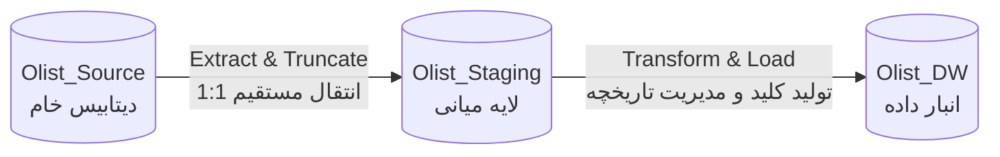

# مستند نگاشت و انتقال داده‌ها (Olist ETL Mapping)

این مستند قوانین استخراج، تبدیل و بارگذاری (ETL) را که برای انتقال داده‌ها از سیستم عملیاتی خام (Source) به لایه میانی (Staging) و در نهایت به انبار داده (Data Warehouse) اعمال شده‌اند، تشریح می‌کند.

## فلوچارت کلی پایپ‌لاین ETL

---

## ۱. نگاشت از لایه منبع به استیجینگ (Source to Staging)
*   **استراتژی:** استخراج کامل (Full Extract) و Truncate-Load
*   **هدف:** استخراج داده‌ها از سیستم عملیاتی و انتقال به محیط Staging بدون اعمال تغییرات سنگین، جهت به حداقل رساندن بار پردازشی (Overhead) روی سیستم مبدا.

| جدول هدف در لایه `Olist_Staging` | جدول مبدا در `Olist_Source` | عملیات / منطق انتقال (Transformation) |
| :--- | :--- | :--- |
| `stg_customers` | `customers` | درج مستقیم داده‌ها (1:1 Direct Insert) |
| `stg_orders` | `orders` | درج مستقیم داده‌ها (1:1 Direct Insert) |
| `stg_order_items` | `order_items` | درج مستقیم داده‌ها (1:1 Direct Insert) |
| `stg_sellers` | `sellers` | درج مستقیم داده‌ها (1:1 Direct Insert) |
| `stg_products` | `products` | درج مستقیم. هندل کردن خطای تایپی `lenght` در دیتاست اصلی Kaggle. |
| `stg_reviews` | `reviews` | درج مستقیم داده‌ها (1:1 Direct Insert) |

---

## ۲. نگاشت ابعاد انبار داده (Staging to Dimensions)
*   **استراتژی:** تخصیص کلید جایگزین (Surrogate Key) و مدیریت ابعاد به کندی متغیر (SCD).

| جدول بُعد (Dimension) | جدول لایه استیجینگ | نوع SCD | منطق نگاشت و تبدیل |
| :--- | :--- | :--- | :--- |
| **`dim_customer`** | `stg_customers` | Type 2 | نگاشت داده‌های جغرافیایی مشتری. تغییر در شهر یا استان باعث ایجاد یک سطر جدید می‌شود. مدیریت تاریخچه با فیلدهای `IsCurrent`، `ValidFrom` و `ValidTo`. |
| **`dim_product`** | `stg_products` | Type 3 | نگاشت ویژگی‌های محصول. در صورت تغییر دسته‌بندی، سطر جدید ایجاد نمی‌شود بلکه فیلد جدیدی برای حفظ تاریخچه در نظر گرفته می‌شود. |
| **`dim_seller`** | `stg_sellers` | Type 1 | به‌روزرسانی اطلاعات فروشنده با استفاده از دستور `MERGE`. داده‌های جدید جایگزین قبلی می‌شوند (بدون حفظ تاریخچه). |
| **`dim_review`** | `stg_reviews` | Static | نگاشت مستقیم. به منظور حفظ یکپارچگی ارجاعی (Referential Integrity)، یک رکورد پیش‌فرض با شناسه `-1` برای داده‌های ناموجود تزریق می‌شود. |
| **`dim_date`** | *تولید رویه‌ای* | N/A | تولید خودکار توسط حلقه `WHILE` در T-SQL از سال ۲۰۱۶ تا ۲۰۱۹. محاسبه روزهای تعطیل با تابع `DATEPART`. |

---

## ۳. نگاشت فکت‌ها و دیتا مارت‌ها (Staging to Facts)
*   **استراتژی:** بارگذاری افزایشی تکرارپذیر (Idempotent Incremental Load) و اعمال کلیدهای خارجی (Foreign Keys).

| جدول فکت (Fact Table) | جداول لایه استیجینگ | منطق نگاشت و تبدیل |
| :--- | :--- | :--- |
| **`fact_sales`** | `stg_orders`, `stg_order_items` | استخراج SK از جداول ابعاد. تبدیل `order_purchase_timestamp` به کلید صحیح `order_date_sk`. استفاده از مکانیزم `WHERE NOT EXISTS` برای جلوگیری از درج رکوردهای تکراری. |
| **`fact_logistics`** | `stg_orders`, `stg_order_items` | محاسبه تاخیر با فرمول: `DATEDIFF(day, estimated, actual)`. جایگزینی مقادیر NULL در فروشنده یا نظر با رکورد `-1` جهت حفظ یکپارچگی دیتا مارت. |
